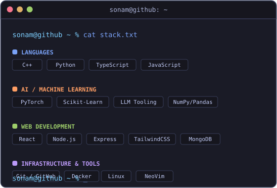
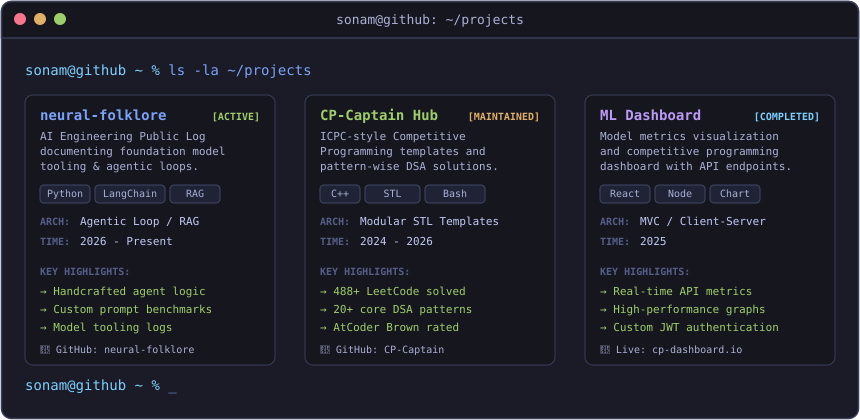
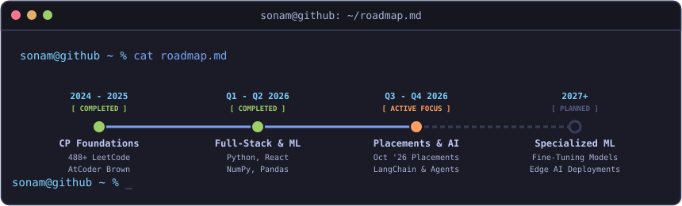
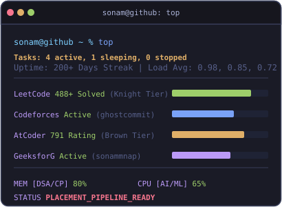
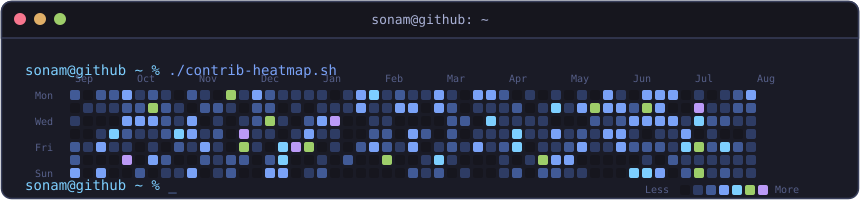

<div align="center">


<br>

<a href="mailto:sonamnarula2108@gmail.com"></a>
<a href="https://www.linkedin.com/in/sonamnarula"></a>
<a href="https://codolio.com/profile/0PG2lf5S"></a>
<a href="https://linktr.ee/SonamNarula"></a>

</div>

<br>

<!-- First Fold: Whoami and Tech Stack side by side (Tmux pane style) -->
<table width="100%" border="0" cellpadding="0" cellspacing="0">
<tr>
<td width="50%" valign="top" align="center">
<h3><code>sonam@github ~ %</code> whoami --verbose</h3>

</td>
<td width="50%" valign="top" align="center">
<h3><code>sonam@github ~ %</code> cat stack.txt</h3>

</td>
</tr>
</table>

<br>

<!-- Section 2: Projects Showcase -->
<div align="center">
<h3><code>sonam@github ~ %</code> ls -la ~/projects</h3>

</div>

<br>

<!-- Section 3: Engineering Roadmap -->
<div align="center">
<h3><code>sonam@github ~ %</code> cat roadmap.md</h3>

</div>

<br>

<!-- Section 4: System Monitor & GitHub Stats -->
<table width="100%" border="0" cellpadding="0" cellspacing="0">
<tr>
<td width="50%" valign="top" align="center">
<h3><code>sonam@github ~ %</code> top</h3>

</td>
<td width="50%" valign="top" align="center">
<h3><code>sonam@github ~ %</code> neofetch --stats</h3>
<br>

<br><br>

</td>
</tr>
</table>

<br>

<!-- Section 5: Contribution Activity Map -->
<div align="center">
<h3><code>sonam@github ~ %</code> ./contrib-heatmap.sh</h3>

</div>

<br>

<!-- Section 6: Philosophy & Details -->
<div align="center">

### `sonam@github ~ %` echo $ENGINEERING_PHILOSOPHY

```
consistency compounds — 200+ day streaks aren't motivation, they're infrastructure.
solve the pattern, not the problem. debug the fundamentals, not the symptom.
ship it, measure it, then make it smarter.
```

</div>

<br>

<div align="center">

### `sonam@github ~ %` cat progress.log

</div>

```yaml
LeetCode    : 488+ solved        → sonamnarula2005
Codeforces  : active             → ghostcommit.cpp
GFG         : active             → sonammnapaqc
AtCoder     : 791 (Brown)        → debut rating
Track       : ICPC-style CP + pattern-wise DSA (20+ patterns)
```

<br>

<div align="center">

</div>
